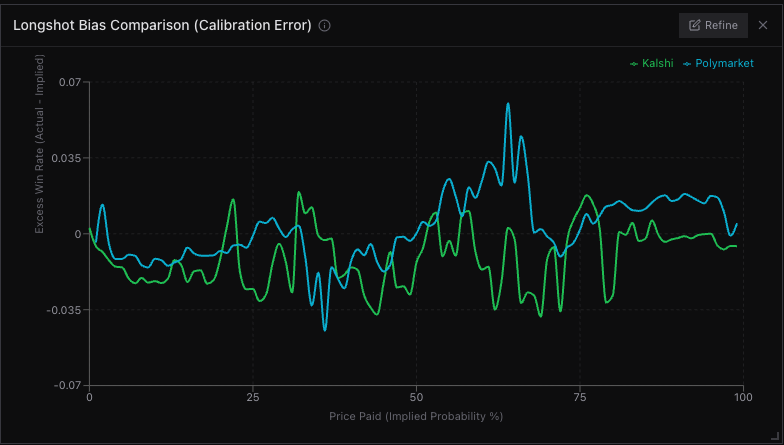
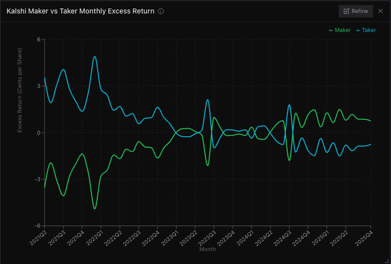
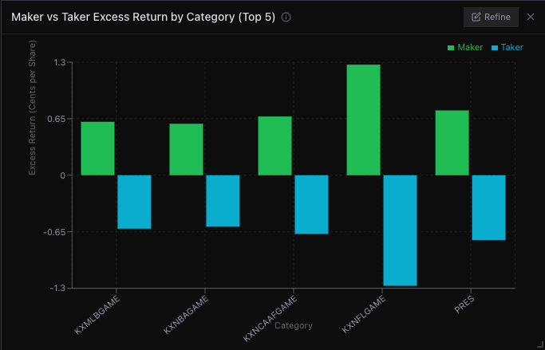

# p[0]

> vibe analytics for prediction markets

Natural language analytics dashboard for Kalshi and Polymarket prediction market data. Ask questions in plain English, get charts. Powered by LLM-generated SQL over DuckDB.

## Features

- **Natural language to SQL** — ask questions, get interactive charts
- **Multi-platform** — Kalshi + Polymarket data side by side
- **Smart charting** — auto-selects chart type, date formatting, number formatting (K/M/B)
- **Widget refinement** — inline editing of any chart with full conversation history
- **Natural language targeting** — reference widgets by name or position ("make the 2nd chart a line chart")
- **Materialized views** — pre-computed aggregations for instant common queries
- **Self-correction** — automatic SQL retry when queries fail
- **Flexible LLM backend** — OpenAI, Anthropic, Gemini, Ollama, or any OpenAI-compatible API

## Examples

> "Compare the longshot bias (calibration error) between Kalshi and Polymarket"



> "Show Kalshi maker vs taker monthly excess return over time"



> "Break down maker vs taker excess return by category on Kalshi (top 5)"



## Architecture

```
┌──────────────────┐     ┌──────────────────┐     ┌──────────────────┐
│  React Frontend  │     │   Fastify API    │     │     DuckDB       │
│  Vite + TW4      │────>│   /api/query     │────>│   (in-memory)    │
│  port 5173       │     │   port 3001      │     │   parquet files  │
└──────────────────┘     └──────────────────┘     └──────────────────┘
                                │
                                v
                         ┌──────────────────┐
                         │   LLM Provider   │
                         │   (OpenAI, etc)  │
                         └──────────────────┘
```

## Tech Stack

| Layer     | Technology                       |
|-----------|----------------------------------|
| Runtime   | Bun                              |
| API       | Fastify, DuckDB, OpenAI SDK      |
| Frontend  | React 19, Vite 6, Tailwind CSS 4 |
| Charts    | Recharts                         |
| State     | Zustand                          |
| Layout    | react-grid-layout                |
| Types     | Shared TypeScript package         |
| LLM Proxy | LiteLLM (optional)               |

## Quick Start

### Prerequisites

- [Bun](https://bun.sh) v1.0+
- An OpenAI API key (or any OpenAI-compatible provider)
- Prediction market data in parquet format ([setup guide](docs/setup.md#data-setup))

### Install

```bash
git clone https://github.com/pzeroai/pzero.git
cd p0
bun install
```

### Get Data

```bash
bun run setup-data
```

### Configure

```bash
cp .env.example .env
# Edit .env — at minimum, set LLM_API_KEY
```

### Run

```bash
bun run dev
```

Open [http://localhost:5173](http://localhost:5173)

## Documentation

- **[Setup Guide](docs/setup.md)** — installation, data, and LLM configuration
- **[Architecture](docs/architecture.md)** — system design and data flow
- **[Usage Guide](docs/usage.md)** — how to use the app with example queries
- **[Contributing](CONTRIBUTING.md)** — development workflow and PR process

## Acknowledgments

Special thanks to [@beckerrjon](https://github.com/Jon-Becker) and [prediction-market-analysis](https://github.com/Jon-Becker/prediction-market-analysis) for the prediction market dataset that powers this project.

## License

[MIT](LICENSE)
